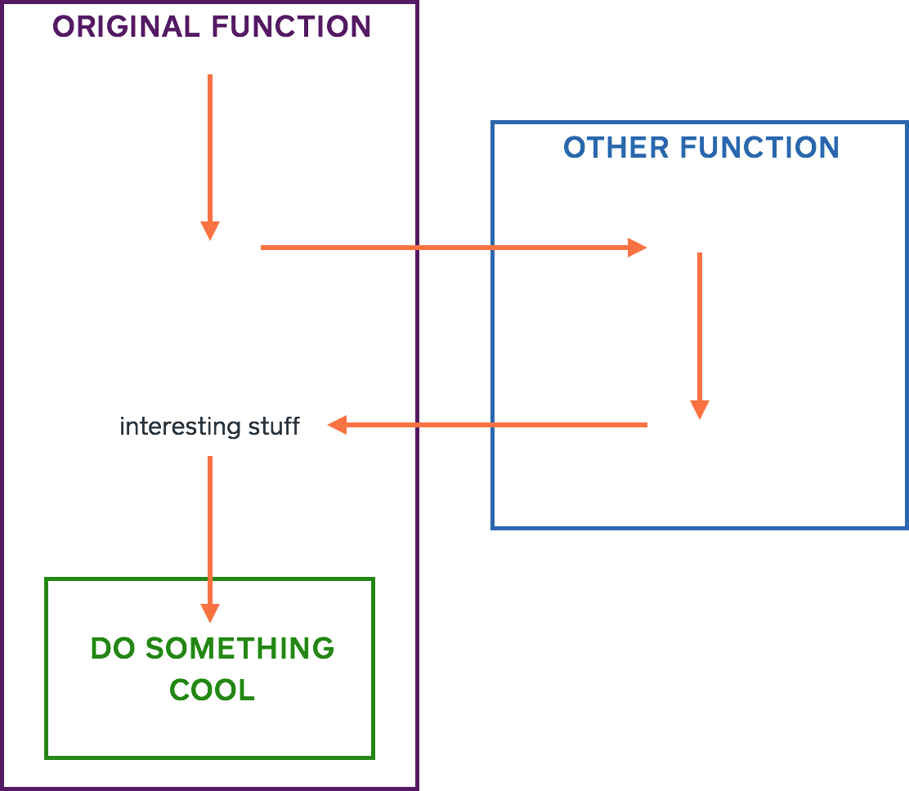
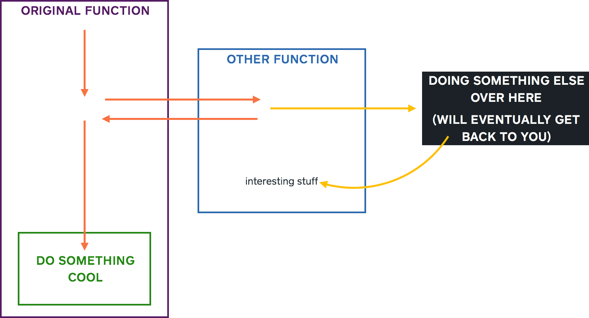
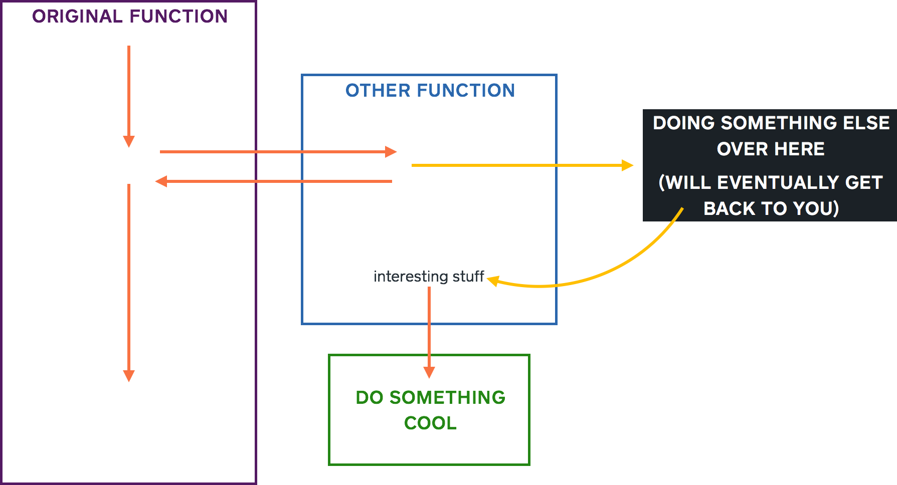

# What is asynchronous code execution?

During normal code execution, we might call out from one function to another function. Only one function can run at a time, so our original function is put aside for a moment while the other function does some work.



When the other function is done, it returns to our original function with some return value. Our original function resumes its execution and can do something with that return value.

However, there are some functions that operate outside the normal code execution. We refer to this as **asynchronous** execution, because it's generally running at the same time as (and totally separate from) the rest of our code.



For example, we might be running some Javascript on our website that needs some data from a server. We call a function that sends a request to the server to get that data.

This request is sent on our behalf, but it takes some time to get all the way there and back. In the meantime, the rest of our Javascript keeps running.

At some point, the request will complete and will return our data. But there's no way to get this data back to our original function.



Instead of trying to get the data back to the original function to do something with it, we tell the asynchronous function what to do when it completes.

This usually looks like passing a callback function as an argument.

```javascript

var do_something_cool = function (result) {
    console.log(result);
};

var original_function = function () {
    // You can define a function inline.
    other_function(function (result) {
        // this is called by function_that_does_something_asynchronous
        do_something_cool(result);
    });
};

var original_function = function () {
    // You can also pass a function by reference.
    // This will do the exact same thing as the example above.
    other_function(do_something_cool);
};

var original_function = function () {
    // But this would not work. Don't do this.
    var result = other_function();
    do_something_cool(result);
};
```

The documentation for an asynchronous function should tell you what types of data you can expect your callback function to receive, if you choose to provide a callback.