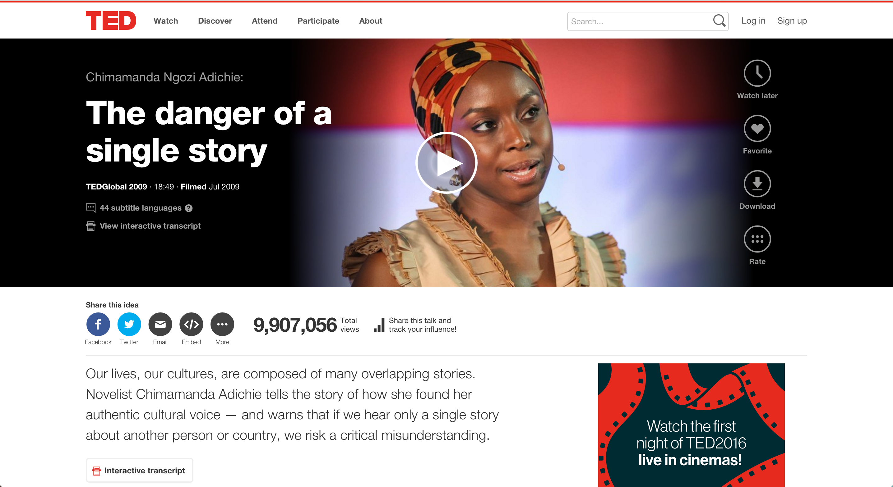
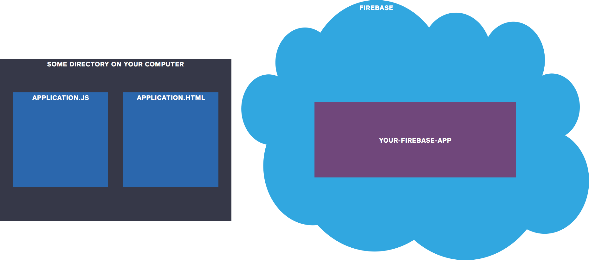

# Step 3: Write hard-coded data via the Javascript Library

## BEFORE

| You should... | What to Review |
|------------|--------|
| ...be able to view and manipulate data in your database's Dashboard. | [Step 2](step2_write_data_manually.md) |
| ...know **your-firebase-app**, the unique description of your database. | [Step 1](step1_setup.md) |
| ...understand the basics of how clients (like websites) interact with a backend to access data. | [What is a backend and why do I need one?](../../explanations/backend.md) |

## DURING

Manipulating data in our database's Dashboard is pretty cool, but not particularly useful for adding a lot of data or allowing other people to access the data.

Let's build out a simple website application. It's going to collect and display recommendations of **Talks You Should Watch**. For example, one of my favorite talks is [this TED Talk](https://www.ted.com/talks/chimamanda_adichie_the_danger_of_a_single_story) by Chimamanda Ngozi Adichie:



For each talk recommendation we want to collect:

* Title of the talk
* Name of the presenter
* Link to video recording of the talk

We probably want to assign each recommendation a unique ID so that we can keep track of it. Here's what a recommendation object might look like in our Firebase database:


If we wanted to represent my talk recommendation above as a JSON object, we could write:

```json
{
    "title": "The danger of a single story",
    "presenter": "Chimamanda Ngozi Adichie",
    "link": "https://www.ted.com/talks/chimamanda_adichie_the_danger_of_a_single_story"
}
```

Okay but how do we get that into our Firebase database? That's where our simple website comes into play.



For now the website will only be available locally, on your computer. It will consist of two files, which should be located in the same directory (or folder) on your machine:

* application.html
* application.js


**application.html** will define the layout of our website using HTML. It will also load **application.js**, which will perform different actions on our website using Javascript.


Some of the actions defined by **application.js** will call out to our Firebase database to read or write data.

**application.html** will also load another Javascript file, which is the [Firebase Javascript library](https://www.firebase.com/docs/web/). Firebase provides this library to abstract away a lot of the work of making requests to the database.

You can access the first version of **application.html** and **application.js** from the [`code_samples/v1`](https://github.com/mchat/tutorials/tree/master/firebase/code_samples/v1) directory of this tutorial.

#### Ways to view and edit code samples:

* Clone this repository from GitHub and open the files directly from the `firebase/code_samples/v1` directory on your local machine.
    - [Learn how to clone a repository.](https://help.github.com/articles/cloning-a-repository/)
    - [View the main page of this repository.](../../../../)
* Open the files [**application.html**](../code_samples/v1/application.html) and [**application.js**](../code_samples/v1/application.js). This shows you a nicely formatted version of the file. To access the raw file, click the **Raw** button at the top right of the file. 
    - Right-click the raw file to save directly to your local machine.
    - Or, copy and paste the raw file into your text editor.
* Copy and paste the code below into your text editor.

Once you've saved these two files on your machine, open them in the text editor of your choice. They should look something like this:

####[application.html](../code_samples/v1/application.html)
```html
<html>
  <head>
    <!-- Load the Firebase library before loading the body. -->
    <script src="https://cdn.firebase.com/js/client/2.4.0/firebase.js"></script>
  </head>

  <body>
    <!-- Load the application script, which will save data to our Firebase app. -->
    <script src="application.js"></script>

    <!-- Honestly, we don't need this but otherwise this page is totally blank and it's kind of hard to tell that it's already loaded. -->
    <h1>Hello world!</h1>
  </body>
</html>
```

####[application.js](../code_samples/v1/application.js)
```javascript
// TODO: Replace with your Firebase app
var myFirebaseApp = "REPLACE-ME-WITH-YOUR-FIREBASE-APP-NAME";

// Reference to your entire Firebase database
var myFirebase = new Firebase("https://" + myFirebaseApp + ".firebaseio.com/");

// Get a reference to the recommendations object of your Firebase.
// Note: this doesn't exist yet. But when we write to our Firebase using
// this reference, it will create this object for us!
var recommendations = myFirebase.child("recommendations");

// Push our first recommendation to the end of the list and assign it a
// unique ID automatically.
recommendations.push({
    "title": "The danger of a single story",
    "presenter": "Chimamanda Ngozi Adichie",
    "link": "https://www.ted.com/talks/chimamanda_adichie_the_danger_of_a_single_story"
});
```

Open **application.html** in any internet browser. It should work like opening any other website, but the URL will correspond to the path of **application.html** on your local machine instead of a proper internet address.

In the browser, you should see something that looks like this:


Seems pretty boring. But go check your Firebase Dashboard.


There's data there! That you added! From a page on your computer!

And it added a really funky string thing. That's the unique URL of the recommendation object we just added. So if we wanted to reference that object, we could do something like:

```javascript
var myFirstRecommendation = new Firebase("https://REPLACE-ME-WITH-YOUR-FIREBASE-APP-NAME.firebaseio.com/recommendations/-KA3ASkQXzynnbFBCbjr");
```

And if we navigate to that URL in our browser, we can see that object in our Dashboard.


|  | You just wrote data to a database in the cloud. That's so legit. If you've never done that before, go tweet about it or something. |
| --- | --- |

### EXTRA CREDIT

1. Move **application.js** to a different directory than **application.html** and figure out how to change the HTML file so that it still loads your Javascript.
2. Define `recommendations` in a single line of Javascript, instead of three. (Hint: read the documentation for the [`child` method](https://www.firebase.com/docs/web/api/firebase/child.html).)
3. Add another field to each recommendations object and update the Javascript to send this new field. Some ideas:
    * a number rating of the talk on a scale of 1 to 5
    * a text description of the talk
    * the name of the recommender
4. "Backfill" your existing recommendations objects by manually entering values for the new field in your database's Dashboard. You want to make sure that all the data in your database adheres to a consistent schema, and that it contains every field you expect it to have!

## AFTER

You can run and develop a simple website locally.

You can write hard-coded data to your database using the Firebase Javascript library.

**Step 4:** [Write user-generated data](step4_write_dynamic_data.md)
