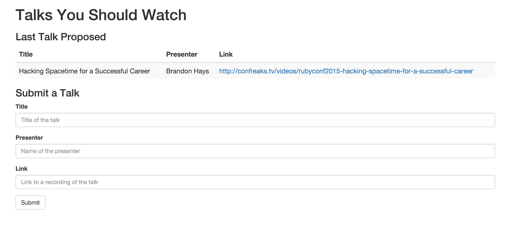
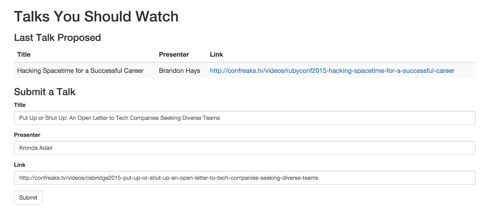
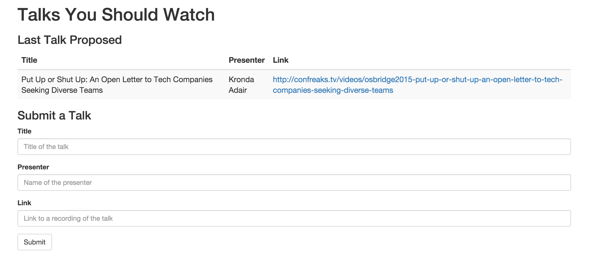

# Step 5: Read user-generated data

## BEFORE

| You should... | What to Review |
|------------|--------|
| ...be able to view and edit the provided code samples on your computer. | [Step 3](step3_write_hard_coded_data.md) |
| ...understand the basics of asynchronous code exection. | [What is asynchronous code execution?](../../explanations/asynchronous.md) | 
| ...be able to write user-generated data to your Firebase database using the Javascript library. | [Step 4](step4_write_dynamic_data.md) |
| ...know **your-firebase-app**, the unique description of your database. | [Step 1](step1_setup.md) |
| ...understand the basics of how clients (like websites) interact with a backend to access data. | [What is a backend and why do I need one?](../../explanations/backend.md) |

## DURING

Writing data is pretty cool, but users probably also want to read some of the data they're writing. Let's show them the most recent recommendation — and let's have it auto-refresh for them. REALTIME. MAGIC.

Go ahead and open up **application.html** and **application.js** from the [`code_samples/v3`](../code_samples/v3) directory.

Need a refresher on how to download these files? Check out [Step3](step3_write_hard_coded_data.md) — but make sure you download the `v3` versions.

####[application.html](../code_samples/v3/application.html)
```html
<html>
  <head>
    <!-- Load the Firebase library before loading the body. -->
    <script src="https://cdn.firebase.com/js/client/2.4.0/firebase.js"></script>

    <!-- Load the jQuery library, which we'll use to manipulate HTML elements with Javascript. -->
    <script src="https://code.jquery.com/jquery-2.2.0.min.js"></script>

    <!-- Load Bootstrap stylesheet, which will is CSS that makes everything prettier and also responsive (aka will work on all devices of all sizes). -->
    <link rel="stylesheet" href="https://maxcdn.bootstrapcdn.com/bootstrap/3.3.6/css/bootstrap.min.css" integrity="sha384-1q8mTJOASx8j1Au+a5WDVnPi2lkFfwwEAa8hDDdjZlpLegxhjVME1fgjWPGmkzs7" crossorigin="anonymous">
  </head>

  <body>
    <!-- Load the application script, which will save data to our Firebase app when we click the button. -->
    <script src="application.js"></script>

    <div class="container">
      <h1>Talks You Should Watch</h1>

      <h3>Last Talk Proposed</h3>

      <table class="table table-striped">
        <thead>
          <tr>
            <th>Title</th>
            <th>Presenter</th>
            <th>Link</th>
          </tr>
        </thead>
        <tbody>
          <tr>
            <!-- This is empty for now, but it will be filled out by an event handler in application.js with the most recent recommendation data from Firebase. -->
            <td id="title"></td>
            <td id="presenter"></td>
            <td><a id="link" target="_blank"></a></td>
          </tr>
        </tbody>
      </table>

      <h3>Submit a Talk</h3>

      <form id="recommendationForm">
        <div class="form-group">
          <label for="talkTitle">Title</label>
          <input class="form-control" id="talkTitle" placeholder="Title of the talk">
        </div>

        <div class="form-group">
          <label for="talkPresenter">Presenter</label>
          <input class="form-control" id="talkPresenter" placeholder="Name of the presenter">
        </div>

        <div class="form-group">
          <label for="talkLink">Link</label>
          <input type="url" class="form-control" id="talkLink" placeholder="Link to a recording of the talk">
        </div>

        <!-- When you click this button, trigger the submit event on this form. -->
        <button type="submit" class="btn btn-default">Submit</button>
      </form>
    </div>
  </body>
</html>
```

Once again, this is mostly the same as `v2` but we did add an extra table to the `body` of **application.html**:

```html
      <h3>Last Talk Proposed</h3>

      <table class="table table-striped">
        <thead>
          <tr>
            <th>Title</th>
            <th>Presenter</th>
            <th>Link</th>
          </tr>
        </thead>
        <tbody>
          <tr>
            <!-- This is empty for now, but it will be filled out by an event handler in application.js with the most recent recommendation data from Firebase. -->
            <td id="title"></td>
            <td id="presenter"></td>
            <td><a id="link" target="_blank"></a></td>
          </tr>
        </tbody>
      </table>
```

####[application.js](../code_samples/v3/application.js)
```javascript
// TODO: Replace with your Firebase app
var myFirebaseApp = "REPLACE-ME-WITH-YOUR-FIREBASE-APP-NAME";

// Reference to the recommendations object in your Firebase
var recommendations = new Firebase("https://" + myFirebaseApp + ".firebaseio.com/recommendations");

// Save a new recommendation to the database, using the input in the form
var submitRecommendation = function () {

  // Get input values from each of the form elements
  var title = $("#talkTitle").val();
  var presenter = $("#talkPresenter").val();
  var link = $("#talkLink").val();

  // Push a new recommendation to the database using those values
  recommendations.push({
    "title": title,
    "presenter": presenter,
    "link": link
  });
};

// Get the single most recent recommendation from the database and
// update the table with its values. This is called every time the child_added
// event is triggered on the recommendations Firebase reference, which means
// that this will update EVEN IF you don't refresh the page. Magic.
recommendations.limitToLast(1).on('child_added', function(childSnapshot) {
  // Get the recommendation data from the most recent snapshot of data
  // added to the recommendations list in Firebase
  recommendation = childSnapshot.val();

  // Update the HTML to display the recommendation text
  $("#title").html(recommendation.title)
  $("#presenter").html(recommendation.presenter)
  $("#link").html(recommendation.link)

  // Make the link actually work and direct to the URL provided
  $("#link").attr("href", recommendation.link)
});

// When the window is fully loaded, call this function.
// Note: because we are attaching an event listener to a particular HTML element
// in this function, we can't do that until the HTML element in question has
// been loaded. Otherwise, we're attaching our listener to nothing, and no code
// will run when the submit button is clicked.
$(window).load(function () {

  // Find the HTML element with the id recommendationForm, and when the submit
  // event is triggered on that element, call submitRecommendation.
  $("#recommendationForm").submit(submitRecommendation);

});
```

Most of **application.js** is the same as `v2`, but we did add one function:

```javascript
// Get the single most recent recommendation from the database and
// update the table with its values. This is called every time the child_added
// event is triggered on the recommendations Firebase reference, which means
// that this will update EVEN IF you don't refresh the page. Magic.
recommendations.limitToLast(1).on('child_added', function(childSnapshot) {
  // Get the recommendation data from the most recent snapshot of data
  // added to the recommendations list in Firebase
  recommendation = childSnapshot.val();

  // Update the HTML to display the recommendation text
  $("#title").html(recommendation.title)
  $("#presenter").html(recommendation.presenter)
  $("#link").html(recommendation.link)

  // Make the link actually work and direct to the URL provided
  $("#link").attr("href", recommendation.link)
});
```

When you reload **application.html**, it should look something like this.



It should go ahead and read the last recommendation that you saved to your Firebase. But what happens if you add another recommendation?



IT REFRESHES! And shows that one. Open **application.html** in another window and submit another recommendation there. Watch the original window – it should update automatically!



Look at that asynchronous code execution wizardry. You are a data magician already.

### EXTRA CREDIT

1. For every additional input you added to your form in the [Step 4 Extra Credit](step4_write_dynamic_data.md), add an additional column to the table HTML.
    - [HTML forms](http://www.w3schools.com/html/html_tables.asp) - indicates the markup used to create HTML tables
2. For every additional table column you add, use jQuery to set its HTML and display the corresponding data from the last recommendation read
    - [jQuery selectors](http://www.w3schools.com/jquery/jquery_ref_selectors.asp) - explains how to select different HTML elements using jQuery
    - [.html()](http://api.jquery.com/html/) - documentation for the `.html()` method of jQuery, commonly used to get or set the HTML contents of HTML elements

### EXTRA, EXTRA CREDIT

**WARNING: The next two challenges are _super_ spicy.** Before you attempt these challenges, you should complete all previous challenges in Steps 3-5.

1. Display the last three recommendations, instead of just the last one.
    - [Firebase Query](https://www.firebase.com/docs/web/api/query/) - documentation on how queries work in Firebase
    - [Firebase.on()](https://www.firebase.com/docs/web/api/query/on.html) - documentation on the types of Firebase events you can listen for using the `.on()` method of the Firebase library
    - [Firebase.limitToLast()](https://www.firebase.com/docs/web/api/query/limittolast.html) - documentation on limiting the number of events received from a Firebase event listener
    - [Firebase DataSnapshot](https://www.firebase.com/docs/web/api/datasnapshot/) - documentation on `DataSnapshot`, which is the type of object that Firebase Queries pass to callbacks
2. Add an input which allows the user to specify an arbitrary number of the most recent recommendations to show. So if the user selects 5, display the last 2 recommendations. If the user selects 2, display the last 2 recommendations.
    - [jQuery DOM Insertion](http://api.jquery.com/category/manipulation/dom-insertion-inside/) - jQuery methods that allow you to insert content inside an existing HTML element
    - [jQuery DOM Removal](http://api.jquery.com/category/manipulation/dom-removal/) - jQuery methods that allow you to remove HTML elements and/or their content

## AFTER

You can use the [jQuery](https://jquery.com/) library to edit the content of HTML elements in response to events.

You can read user-generated data from your database in real-time.

**Step 6:** [Advanced topics in data wizardry](step6_advanced_topics.md)
